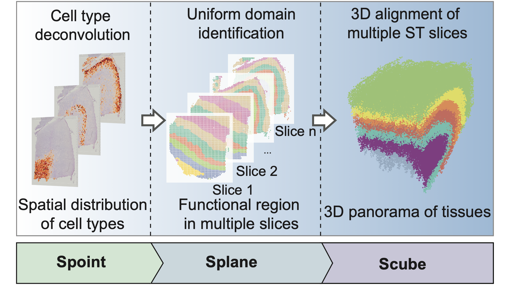

[](https://spacel.readthedocs.io/en/latest/?badge=latest)


# SPACEL: characterizing spatial transcriptome architectures by deep-learning


SPACEL (**SP**atial **A**rchitecture **C**haracterization by d**E**ep **L**earning) is a Python package of deep-learning-based methods for ST data analysis. SPACEL consists of three modules: 
* Spoint embedded a multiple-layer perceptron with a probabilistic model to deconvolute cell type composition for each spot on single ST slice.
* Splane employs a graph convolutional network approach and an adversarial learning algorithm to identify uniform spatial domains that are transcriptomically and spatially coherent across multiple ST slices.
* Scube automatically transforms the spatial coordinate systems of consecutive slices and stacks them together to construct a three-dimensional (3D) alignment of the tissue.

## Getting started
* [Requirements](#Requirements)
* [Installation](#Installation)
* Tutorials
    * [Spoint tutorial: Deconvolution of cell types compostion on human brain Visium dataset](docs/tutorials/deconvolution_of_cell_types_distribution.ipynb)
    * [Splane tutorial: Identify uniform spatial domain on human breast cancer Visium dataset](docs/tutorials/identification_of_uniform_spatial_domain.ipynb)
    * [Scube tutorial: Alignment of consecutive ST slices on human brain MERFISH dataset](docs/tutorials/alignment_of_multiple_slices.ipynb)
    * [Scube tutorial: 3D expression modeling with gaussian process regression](docs/tutorials/3D_expression_modeling.ipynb)

Read the [documentation](https://spacel.readthedocs.io) for more information.

## Latest updates
### Version 1.1.0 2023-07-11
#### Features
* All code based on `Tensorflow` have been mirated to `PyTorch`, it does not have `Tensorflow` as dependency anymore.
* The `Splane.utils.add_cell_type_composition` function has been implemented to facilitate the cell type composition predicted by deconvolution methods into Splane.
* Spoint and Splane now support tqdm type output for improved progress tracking.
    
## Requirements

To install `SPACEL`, you need to install [PyTorch](https://pytorch.org) with GPU support first. If you don't need GPU acceleration, you can just skip the installation for `cudnn` and `cudatoolkit`.
* Create conda environment for `SPACEL`:
```
conda env create -f environment.yml
```
or
```
conda create -n SPACEL -c conda-forge -c default cudatoolkit=10.2 python=3.8 r-base r-fitdistrplus
```
You must choose correct `PyTorch`, `cudnn` and `cudatoolkit` version dependent on your graphic driver version. 
* Test if [PyTorch](https://pytorch.org) for GPU available:
```
python
>>> import torch
>>> torch.cuda.is_available()
```
If these command line have not return `True`, please check your gpu driver version and `cudatoolkit` version. For more detail, look at [CUDA Toolkit Major Component Versions](https://docs.nvidia.com/cuda/cuda-toolkit-release-notes/index.html#cuda-major-component-versions).

Note: If you want to run 3D expression GPR model in Scube, you need to install the [Open3D](http://www.open3d.org/docs/release/) python library first.

## Installation
* Install `SPACEL`:
```
pip install SPACEL
```
